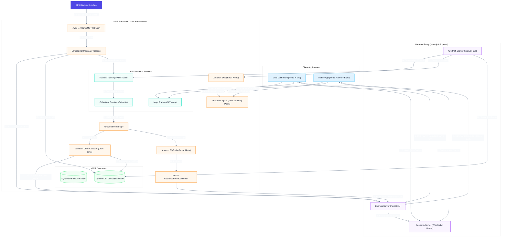
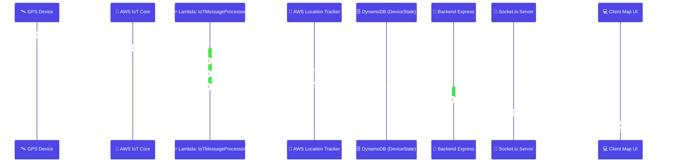
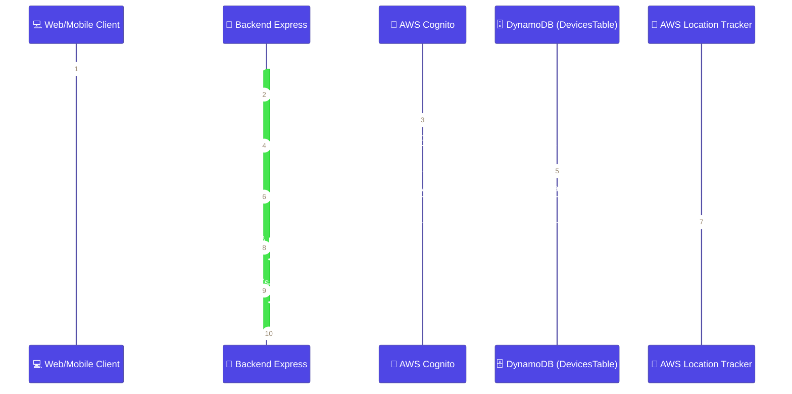
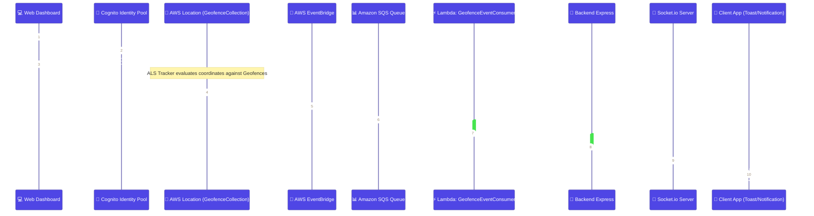
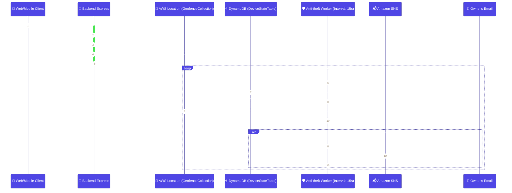
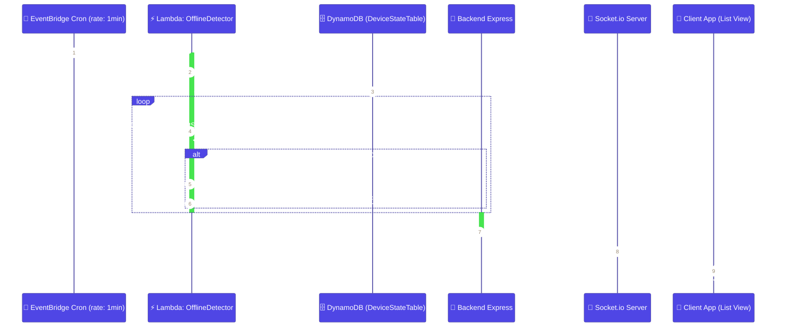

# Smart Fleet Management — Cloud-based Vehicle GPS Tracking and Management System (IoT)

> **Graduation Project** — Real-time GPS Tracking, Geofencing, Anti-theft protection, and instant intrusion alerts system, built entirely on AWS Serverless Cloud Architecture.

## Quick local start

From the `DATN` directory, start the configured local services with:

```bash
./start-system.sh
```

The script starts the backend (port 3001) and web dashboard (port 5173) by default.
Pass `--with-mobile` if you want to start the Expo mobile app as well.
Use `./start-system.sh --help` to view all available options. Press `Ctrl+C` or run `./stop-system.sh`
to stop all running services. Service logs are retained under `.runtime/logs/`.

---

## Table of Contents

1. [Project Overview](#1-project-overview)
2. [Source Code Directory Structure](#2-source-code-directory-structure)
3. [System Architecture](#3-system-architecture)
4. [AWS Services Utilized](#4-aws-services-utilized)
5. [System Workflows](#5-system-workflows)
6. [Deployment Guide](#6-deployment-guide)
   - [Step 1: System Prerequisites](#step-1-system-prerequisites)
   - [Step 2: Deploy AWS Infrastructure](#step-2-deploy-aws-infrastructure)
   - [Step 3: Configure & Run Backend](#step-3-configure--run-backend)
   - [Step 4: Configure & Run Frontend Web Dashboard](#step-4-configure--run-frontend-web-dashboard)
   - [Step 5: Configure & Run Mobile App](#step-5-configure--run-mobile-app)
   - [Step 6: GPS Simulation & End-to-End Testing](#step-6-gps-simulation--end-to-end-testing)
7. [API Reference](#7-api-reference)
8. [Troubleshooting & FAQ](#8-troubleshooting--faq)
9. [Local-First & ngrok Webhook Workflow](#9-local-first--ngrok-webhook-workflow)
10. [Technology Stack](#10-technology-stack)
11. [References](#11-references)

---

## 1. Project Overview

### Problem Statement

Traditional fleet management systems usually require dedicated physical servers, resulting in high operational costs, maintenance overhead, and poor scalability. The **Smart Fleet Management** project solves these issues by leveraging a modern **Serverless Event-Driven Architecture** on AWS, eliminating server management while ensuring high availability, lower latency, and pay-as-you-go cost-efficiency.

### Key Features

| Feature | Description |
|---|---|
| **Real-time GPS Tracking** | Visualizes live vehicle locations on high-performance vector maps |
| **Geofencing** | Custom virtual boundaries (Polygon/Circle) with instant entrance/exit notifications |
| **Anti-theft Security** | Automatic 2-meter radius geofencing around parked vehicles with instant push/email alerts on breach |
| **Multi-platform** | Synchronized Web Dashboard (React) + Mobile App (React Native/Expo) |
| **Identity & Authentication** | Secure user registration/sign-in using Amazon Cognito + JWT verification |
| **Position History** | Replays past vehicle travel routes along a timeline with detailed logs |
| **Serverless & Scalable** | Entire pipeline scale dynamically based on ingestion load, keeping maintenance near zero |
| **Infrastructure as Code (IaC)** | Deploys 30+ AWS resources using a single command via AWS CloudFormation/SAM |

---

## 2. Source Code Directory Structure

The project is structured into **4 independent modules**, enabling isolated development and deployment:

```
7-DATN/
│
├── tracking-data-streaming-infrastructure/   ← AWS Serverless Infrastructure (IaC)
│   ├── template.yml                             # Primary SAM Template (30+ AWS resources)
│   ├── packaged.yml                             # Packaged Template containing S3 URIs
│   └── lambda/                                  # Serverless Functions (Python 3.12)
│       ├── iot-message-processor/               #   → Parses MQTT packets & updates ALS Tracker
│       ├── geofence-event-consumer/             #   → Processes Geofence breach events from SQS
│       ├── realtime-event-publisher/            #   → Publishes real-time events to clients via IoT Core
│       └── offline-detector/                    #   → Cron job identifying offline devices (every 1min)
│
├── tracking-data-streaming-backend/          ← Node.js REST API & Socket.io Proxy
│   ├── index.js                                 # Entry point (Express server & Socket.io, port 3001)
│   ├── src/
│   │   ├── config/
│   │   │   ├── aws.js                           #   AWS SDK clients configuration
│   │   │   ├── constants.js                     #   Global constants & thresholds
│   │   │   ├── realtime.js                      #   Real-time telemetry flags
│   │   │   ├── realtimeEventSchema.js           #   Real-time event validations
│   │   │   └── swagger.js                       #   Swagger/OpenAPI UI config
│   │   ├── controllers/
│   │   │   ├── deviceController.js              #   CRUD operations & location metadata merging
│   │   │   ├── authController.js                #   Cognito user auth controller
│   │   │   └── antitheftController.js           #   Anti-theft activation and status
│   │   ├── routes/
│   │   │   ├── devices.js                       #   /api/devices endpoints
│   │   │   ├── auth.js                          #   /api/auth endpoints
│   │   │   └── antitheft.js                     #   /api/antitheft endpoints
│   │   ├── services/
│   │   │   ├── dynamoService.js                 #   DynamoDB wrapper
│   │   │   ├── locationService.js               #   Amazon Location Service wrapper
│   │   │   ├── snsService.js                    #   SNS SMS/Email notifications
│   │   │   ├── antitheftWorker.js               #   Parked vehicle monitor thread (15s interval)
│   │   │   └── geoUtils.js                      #   Distance calculations (Turf.js)
│   │   └── middleware/
│   │       ├── auth.js                          #   Cognito ID Token JWT verifier
│   │       └── errorHandler.js                  #   Global error catcher
│   └── scripts/
│       ├── interactive-move.js                  #   Interactive GPS Simulator (MQTT → IoT Core)
│       ├── move-device.js                       #   Single device route simulator
│       └── backfill-device-owners.js            #   Owner backfill utility script
│
├── tracking-data-streaming-datn/             ← Web Client (React 19 + Vite 8)
│   ├── index.html                               # HTML Entry
│   ├── vite.config.js                           # Vite bundler config (port 5173)
│   ├── tailwind.config.js                       # TailwindCSS styles configuration
│   └── src/
│       ├── App.jsx                              # Router, auth checks, and Socket.io client
│       ├── configuration.js                     # Local AWS config mapping
│       ├── components/
│       │   ├── auth/                            #   Sign-in, sign-up, and confirmation forms
│       │   ├── map/                             #   MapLibre GL map view & draw controllers
│       │   ├── devices/                         #   Vehicle list, details, and forms
│       │   ├── geofences/                       #   Geofencing controls & drawers
│       │   └── layout/                          #   Sidebar and Header layouts
│       ├── hooks/                               #   Custom React hooks (useDeviceManager, etc.)
│       ├── api/                                 #   Fetch-based REST client
│       └── utils/                               #   AWS Identity Pool credentials resolver
│
└── vsmart-app/                               ← Mobile Client (React Native + Expo SDK 54)
    ├── app.json                                 # Expo configuration file
    ├── app/                                     # File-based navigation screens
    │   ├── _layout.jsx                          #   Root provider layout
    │   ├── login.jsx                            #   Login screen
    │   ├── onboarding.jsx                       #   Onboarding flow
    │   ├── map.jsx                              #   Full screen map tracking view
    │   ├── scan.jsx                             #   Camera QR/Barcode scanner
    │   └── (tabs)/                              #   Tab navigator (Home, Devices, Settings)
    └── src/
        ├── configuration.js                     #   Mobile AWS configuration constants
        ├── contexts/                            #   Global contexts (DeviceDataContext, etc.)
        └── utils/                               #   Cognito authentication & AWS SDK helpers
```

---

## 3. System Architecture

The system utilizes an **Event-Driven Serverless Ingestion Pipeline** on AWS coupled with a **Node.js WebSockets Proxy** to handle live telemetry feeds with millisecond latency:



### Architectural Design Principles

| Principle | Description |
|---|---|
| **Separation of Concerns** | Decouples IoT telemetry ingestion from application API layers to prevent system crashes on high device activity. |
| **Event-Driven & Serverless** | Coordinates flow automatically through EventBridge, SQS, and Lambda, providing cost-efficiency and horizontal scaling. |
| **Dual Data Pipeline** | Integrates low-cost NoSQL storage (DynamoDB for metadata) with specialized geo-caching databases (Amazon Location Tracker for spatial coordinates). |
| **WebSockets API Gateway Proxy** | Connects clients via lightweight Socket.io WebSockets instead of direct AWS MQTT. The backend exposes a secure `/api/realtime/event` webhook called by AWS Lambda. |
| **Cognito-Federated Identity** | Uses Amazon Cognito User Pools for authorization. The client exchanges JWT tokens for AWS temporary credentials via Cognito Identity Pools to read map vector tiles directly. |

---

## 4. AWS Services Utilized

### Core Services

| Service | Resource Name | Purpose |
|---|---|---|
| **Amazon Location Service** | `TrackingDATN-Map` | Renders map vector tiles (Esri Navigation style) |
| | `TrackingDATN-Tracker` | Caches coordinates history, applies `DistanceBased` filtering |
| | `TrackingDATN-GeofenceCollection` | Stores geofence boundary coordinates |
| **AWS IoT Core** | Rule: `UpdateLocationTracker` | Receives incoming MQTT telemetry and routes payload to Lambda |
| **Amazon DynamoDB** | `TrackingDATN-Devices` | Device profiles database (name, license plate, status) |
| | `TrackingDATN-DeviceState` | Live runtime state database (online flag, last seen timestamp, anti-theft trigger) |
| **Amazon Cognito** | `TrackingDATN-UserPool` | Secure registration and login gateway |

### Supporting Services

| Service | Resource Name | Purpose |
|---|---|---|
| **AWS Lambda** | `IoTMessageProcessor` | Validates telemetry ➔ updates location ➔ calls Backend Webhook |
| | `GeofenceEventConsumer` | Handles geofence breaches ➔ calls Backend Webhook |
| | `OfflineDetector` | Queries the online-state index and identifies offline vehicles (>120s) |
| **Amazon EventBridge** | `GeofenceEventRule` | Captures geofence breach notifications ➔ routes to SQS |
| | `OfflineDetectorSchedule` | Generates cron triggers every minute |
| **Amazon SQS** | `GeofenceEvents` | Queues geofence breach events for batch consumption |
| **Amazon SNS** | `AntitheftAlerts` | Dispatches warning emails to owners on anti-theft breaches |
| | `IoTErrors` | Emails administrators on processing failures |
| **CloudFormation** | `TrackingDATN-UnifiedStack` | Deploys the entire backend cloud infrastructure as code |

---

## 5. System Workflows

### A. Location Telemetry Pipeline — GPS → Cloud → Clients

Updates vehicle markers on the map within milliseconds of receiving a new GPS coordinate:



---

### B. Device Registration & Retrieval Workflow

Fetches registered devices, resolving metadata and coordinates from distinct databases:



---

### C. Geofencing Warning Pipeline

Monitors boundary crossings and alerts clients in real-time:



---

### D. Anti-theft Protection Workflow

Secures parked vehicles using automated, short-range geofencing:



---

### E. Silent Offline Detection Workflow

Automatically detects lost network or GPS connection:



---

## 6. Deployment Guide

### Step 1: System Prerequisites

Ensure you have the following installed on your development machine:

| Tool | Version | Description |
|---|---|---|
| **Node.js** | v20+ LTS | JavaScript Runtime for Backend and Frontend |
| **npm** | v10+ | Package manager |
| **AWS CLI** | v2 | Configured with `aws configure` |
| **AWS Account** | — | Requires permissions for: CloudFormation, IAM, Lambda, Location Service, IoT Core, Cognito, DynamoDB, SNS, SQS, EventBridge |
| **ngrok** | Latest | Used to route local Node.js server for AWS Lambda webhooks |

#### Configure AWS CLI

```bash
aws configure
# AWS Access Key ID: AKIA...
# AWS Secret Access Key: ...
# Default region name: ap-southeast-1
# Default output format: json
```

---

### Step 2: Deploy AWS Infrastructure

The AWS Cloud Services are declared as Infrastructure as Code in `template.yml` under `tracking-data-streaming-infrastructure/`.

#### 2.1. Clone the Repository
```bash
git clone https://github.com/Tracking-Data-Streaming/.github.git
cd 7-DATN
```

#### 2.2. Create an S3 Bucket for Lambda Artifacts
AWS CloudFormation requires a globally unique S3 bucket to package Lambda code before deployment:
```bash
aws s3 mb s3://vsmart-tracking-artifacts-by-tranvix0910 --region ap-southeast-1
```

#### 2.3. Package the Template
Zip the Lambda code, upload it to S3, and generate the template containing absolute S3 URIs:
```bash
cd tracking-data-streaming-infrastructure
aws cloudformation package \
  --template-file template.yml \
  --s3-bucket vsmart-tracking-artifacts-by-tranvix0910 \
  --output-template-file packaged.yml \
  --region ap-southeast-1
```

#### 2.4. Expose the Local Webhook Port via ngrok
To receive real-time telemetry events from AWS Lambda on your local machine, start an ngrok tunnel pointing to your local Express server (port 3001):
```bash
ngrok http 3001
```
Copy the generated HTTPS Forwarding URL ending with `.dev` (e.g. `https://abc-123.ngrok-free.dev`). Your Webhook URL will be:
`https://abc-123.ngrok-free.dev/api/realtime/event`

#### 2.5. Deploy the Stack
Deploy the CloudFormation template, passing your email and your ngrok webhook URL:
```bash
aws cloudformation deploy \
  --template-file packaged.yml \
  --stack-name TrackingDATN-UnifiedStack \
  --capabilities CAPABILITY_NAMED_IAM \
  --parameter-overrides AlertEmail="tranvix.work@gmail.com" BackendWebhookUrl="https://abc-123.ngrok-free.dev/api/realtime/event" \
  --region ap-southeast-1
```
*(Replace `https://abc-123.ngrok-free.dev` with your actual active ngrok URL).*

> 💡 **Tip:** If your ngrok URL changes after restarting ngrok, you do **not** need to redeploy the whole CloudFormation stack. You can quickly update the 3 Lambda functions via AWS CLI:
> ```bash
> export NGROK_URL="https://YOUR_NEW_NGROK.ngrok-free.dev/api/realtime/event"
>
> for fn in $(aws lambda list-functions --region ap-southeast-1 --query "Functions[?starts_with(FunctionName, 'TrackingDATN-UnifiedStack')].FunctionName" --output text); do
>   aws lambda update-function-configuration --function-name "$fn" \
>     --environment "Variables={$(aws lambda get-function-configuration --function-name "$fn" --region ap-southeast-1 --query "Environment.Variables" --output json | jq -r 'to_entries | map("\(.key)=\(.value)") | join(",")' | sed "s|BACKEND_WEBHOOK_URL=[^,]*|BACKEND_WEBHOOK_URL=$NGROK_URL|")}" \
>     --region ap-southeast-1 >/dev/null 2>&1
> done
> ```

#### 2.6. Confirm SNS Subscription
AWS will send a validation email to the configured `AlertEmail`. **Open the email and click "Confirm subscription"** to enable anti-theft emails.

#### 2.7. Extract CloudFormation Outputs
Export the resource IDs needed to configure your client applications:
```bash
aws cloudformation describe-stacks \
  --stack-name TrackingDATN-UnifiedStack \
  --query "Stacks[0].Outputs" \
  --output table \
  --region ap-southeast-1
```

#### 2.8. Create Location Service API Key (Mandatory)
AWS Location Service maps require an API key for map rendering, which must be created manually:

```bash
ACCOUNT_ID=$(aws sts get-caller-identity --query Account --output text)

aws location create-key \
  --key-name TrackingDATN-MapApiKey \
  --restrictions "{
    \"AllowActions\": [\"geo:GetMapStyleDescriptor\",\"geo:GetMapGlyphs\",\"geo:GetMapSprites\",\"geo:GetMapTile\"],
    \"AllowResources\": [\"arn:aws:geo:ap-southeast-1:${ACCOUNT_ID}:map/TrackingDATN-Map\"]
  }" \
  --no-expiry \
  --region ap-southeast-1 \
  --query "Key" --output text
```

---

### Step 3: Configure & Run Backend

#### 3.1. Install Dependencies
```bash
cd ../tracking-data-streaming-backend
npm install
```

#### 3.2. Configure Environment Variables (`.env`)
```bash
cp .env.example .env
```
Open `.env` and fill in the output parameters:
```env
PORT=3001
NODE_ENV=development
AWS_REGION=ap-southeast-1
AWS_PROFILE=default # Local development only; use an IAM role in production
DYNAMODB_DEVICES_TABLE=TrackingDATN-Devices
LOCATION_TRACKER_NAME=TrackingDATN-Tracker
LOCATION_GEOFENCE_COLLECTION=TrackingDATN-GeofenceCollection
SNS_ANTITHEFT_TOPIC_ARN=arn:aws:sns:ap-southeast-1:xxxxxx:TrackingDATN-AntitheftAlerts
CORS_ORIGIN=*
COGNITO_USER_POOL_ID=ap-southeast-1_xxxxxx
COGNITO_CLIENT_ID=xxxxxx
REALTIME_WEBHOOK_KEY=vsmart_secret_telemetry_key
```

#### 3.3. Start the Server
```bash
npm start
```
*Successful log:* `🔌 Realtime: Socket.io server integrated and running`

---

### Step 4: Configure & Run Frontend Web Dashboard

#### 4.1. Install Dependencies
```bash
cd ../tracking-data-streaming-datn
npm install
```

#### 4.2. Configure Environment Variables (`.env`)
```bash
cp .env.example .env
```
Fill in the parameters in `.env`:
```env
VITE_BACKEND_URL=http://localhost:3001
VITE_AWS_REGION=ap-southeast-1
VITE_USER_POOL_ID=ap-southeast-1_xxxxxx
VITE_USER_POOL_CLIENT_ID=xxxxxx
VITE_MAP_API_KEY=v1.public.eyJ... # Map API Key generated in step 2.8
VITE_MAP_STYLE=Standard
VITE_MAP_COLOR_SCHEME=Light
VITE_GEOFENCE_COLLECTION=TrackingDATN-GeofenceCollection
```

#### 4.3. Start the Web App
```bash
npm run dev
```
Open `http://localhost:5173` on your browser.

---

### Step 5: Configure & Run Mobile App

#### 5.1. Install Dependencies
```bash
cd ../vsmart-app
npm install
```

#### 5.2. Configure Settings
Copy `.env.example` to `.env` and point the app to the backend (use a LAN URL for local devices and HTTPS for production):
```env
EXPO_PUBLIC_BACKEND_URL=http://192.168.1.xxx:3001
EXPO_PUBLIC_AWS_REGION=ap-southeast-1
EXPO_PUBLIC_USER_POOL_ID=ap-southeast-1_xxxxxx
EXPO_PUBLIC_USER_POOL_CLIENT_ID=xxxxxx
```

#### 5.3. Start the App
```bash
npm start
```
Scan the QR Code with the **Expo Go** application on your smartphone (connected to the same WiFi LAN).

---

### Step 6: GPS Simulation & End-to-End Testing

#### 6.1. Start the Simulator
Open a new terminal window inside `tracking-data-streaming-backend` and run:
```bash
node scripts/interactive-move.js
```
#### 6.2. Simulate Route Movement
Type the following command at the prompt `📍 Command >` to begin sending GPS coordinate packages:
```bash
auto 10.8481 106.7864 30
```
On your browser, you will observe the vehicle marker moving smoothly on the map in real-time (2-second intervals).

---

## 7. API Reference

### Auth Endpoints (Public)

| Method | Endpoint | Description |
|---|---|---|
| `POST` | `/api/auth/register` | Signs up a new account (email & password) |
| `POST` | `/api/auth/confirm` | Confirms registration using OTP verification |
| `POST` | `/api/auth/login` | Authenticates user and returns JWT |
| `POST` | `/api/auth/resend-code` | Re-sends the verification code |

### Device Endpoints (Protected)

| Method | Endpoint | Description |
|---|---|---|
| `GET` | `/api/devices` | Returns registered device list merged with positions |
| `GET` | `/api/devices/:id` | Returns metadata details for a specific device |
| `GET` | `/api/devices/:id/history` | Returns coordinate path history for timeline routing |
| `POST` | `/api/devices` | Registers a new device |
| `PUT` | `/api/devices/:id` | Updates device metadata |
| `DELETE` | `/api/devices/:id` | Deletes a device and clear tracker logs |

### Anti-theft Endpoints (Protected)

| Method | Endpoint | Description |
|---|---|---|
| `POST` | `/api/antitheft/:deviceId/enable` | Activates protection (creates R=2m geofence) |
| `POST` | `/api/antitheft/:deviceId/disable` | Deactivates anti-theft (removes geofence) |

### Webhook & Diagnostics

| Method | Endpoint | Description |
|---|---|---|
| `POST` | `/api/realtime/event` | Endpoint receiving Lambda webhook signals (API Key protected) |
| `GET` | `/health` | Informs backend health status and active configuration |
| `GET` | `/api-docs` | Interactive Swagger API documentation |

---

## 8. Troubleshooting & FAQ

#### Lambda error: `Float types are not supported` in CloudWatch
* **Cause**: DynamoDB does not support native Python `float` types.
* **Solution**: The code has been updated to automatically cast floats to `decimal.Decimal` before saving coordinates in DynamoDB (`DeviceStateTable`).

#### Webhook errors: `HTTP Error 404: Not Found`
* **Cause**: Typo in the `BackendWebhookUrl` parameter or ngrok tunnel pointing to incorrect port.
* **Solution**: Ensure your ngrok tunnel is up and ends with `.dev`. Run `aws lambda get-function-configuration` to confirm `BACKEND_WEBHOOK_URL` matches your tunnel url exactly.

#### Map is blank or fails to load style
* **Cause**: Map API Key is incorrect, expired, or has improper resource constraints.
* **Solution**: Double-check `VITE_MAP_API_KEY` matches the key created in Step 2.8. Ensure the key restrictions grant allow actions on the map resource `TrackingDATN-Map`.

---

## 9. Local-First & ngrok Webhook Workflow

The entire system is designed to run **100% locally on your development machine** without requiring external cloud app hosts or VPS.

### 9.1. Local-First Architecture

```
[ GPS Device / Simulator ] ──► [ AWS IoT Core ] ──► [ AWS Lambda ]
                                                          │
                                                (Webhook via ngrok)
                                                          │
                                                          ▼
[ Local Browser / Mobile ] ◄─── [ Socket.io ] ◄─── [ Local Express (Port 3001) ]
```

1. **Local Express Server (Port 3001)**: Handles all REST API requests, database queries, and WebSocket broadcasting.
2. **ngrok Tunnel**: Creates a secure public tunnel to route AWS Lambda webhook calls back to your machine.
3. **Local Web App (Port 5173)**: Connects directly to `http://localhost:3001`.
4. **Local Mobile App (Port 8081)**: Connects to your computer's LAN IP (e.g. `http://192.168.1.x:3001`).

### 9.2. Daily Local Development Workflow

1. **Start ngrok (Tab 1):**
   ```bash
   ngrok http 3001
   ```
2. **Start the local services (Tab 2):**
   ```bash
   ./start-system.sh
   ```
3. **Run GPS Simulation (Tab 3):**
   ```bash
   cd tracking-data-streaming-backend
   node scripts/interactive-move.js
   ```
4. **Stop everything when finished:**
   ```bash
   ./stop-system.sh
   # Or press Ctrl+C in Tab 2
   ```

---

## 10. Technology Stack

### Frontend & Mobile
* **React 19.2** & **Vite 8.0**
* **React Native v0.81** & **Expo SDK 54**
* **MapLibre GL JS** (Vector Tiles Rendering)
* **Tailwind CSS** (Utility-first Styling)
* **AWS Amplify (Auth v6)**
* **Socket.io Client** (WebSocket Telemetry)

### Backend Services
* **Node.js v20** & **Express.js**
* **Socket.io Server**
* **AWS SDK for JS (v3)**
* **Swagger OpenAPI UI**

### Cloud Infrastructure
* **AWS CloudFormation / SAM**
* **Amazon Location Service (Maps, Tracker, Geofences)**
* **AWS IoT Core**
* **Amazon DynamoDB**
* **Amazon EventBridge & SQS & SNS**

---

## 11. References

* [Amazon Location Service Developer Guide](https://docs.aws.amazon.com/location/)
* [AWS IoT Core Developer Guide](https://docs.aws.amazon.com/iot/)
* [Socket.io Official Documentation](https://socket.io/docs/v4/)
* [Expo Router Navigation Guidelines](https://docs.expo.dev/router/introduction/)

---

## LICENSE
This project is licensed under the **MIT License** — see the [LICENSE](LICENSE) file for details.

---

## Thesis Metadata

| Parameter | Detail |
|---|---|
| **Thesis Title** | Cloud-based IoT Fleet Management and Real-time Tracking System |
| **Academic Level** | Graduation Thesis (Bachelor of Engineering) |
| **Architecture** | Serverless Ingestion + Node.js WebSockets Proxy |
| **Cloud Provider** | Amazon Web Services (AWS) |
| **Default Region** | `ap-southeast-1` (Singapore) |

---
<div align="center">
  <b>Happy Tracking!</b>
</div>
