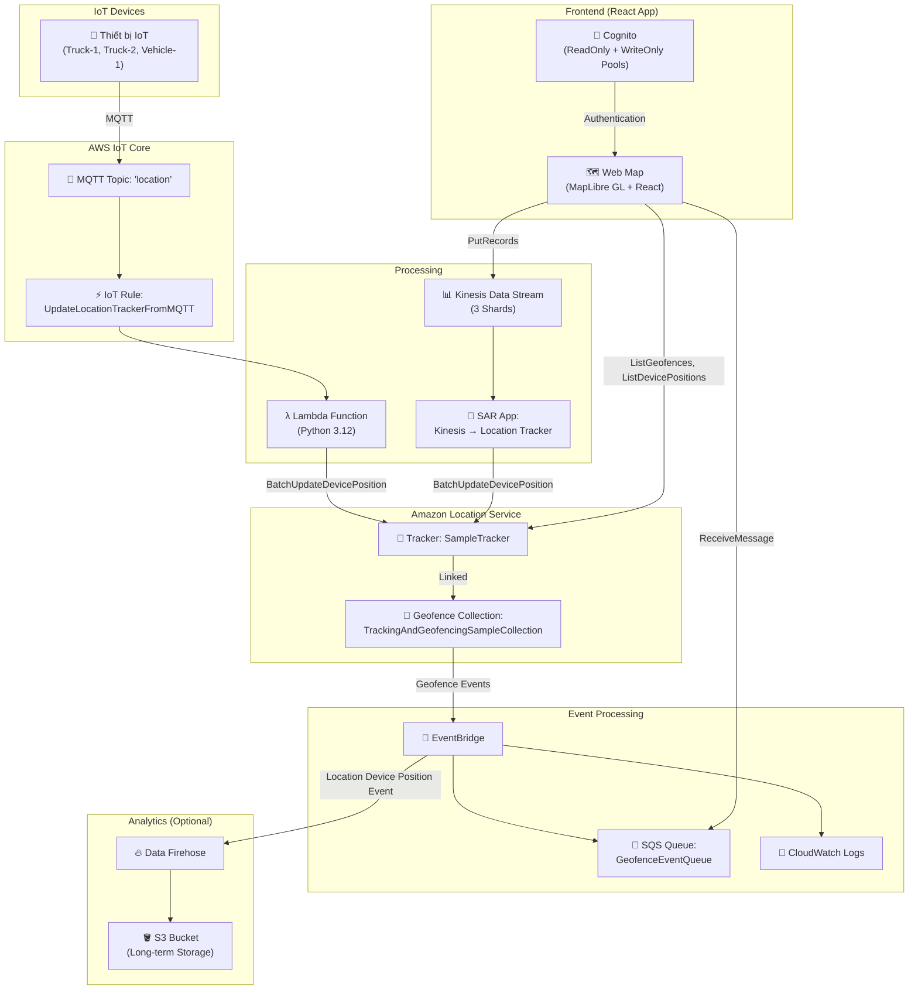
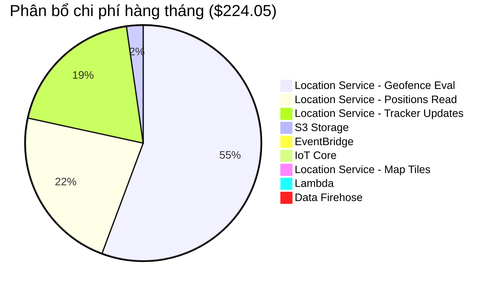

# 📋 Hướng Dẫn Chi Tiết Triển Khai & Chi Phí Dự Án
## Guidance for Tracking Assets & Locating Devices Using AWS IoT

---

## Mục Lục

1. [Tổng Quan Dự Án](#1-tổng-quan-dự-án)
2. [Kiến Trúc Hệ Thống](#2-kiến-trúc-hệ-thống)
3. [Phân Tích Code Chi Tiết](#3-phân-tích-code-chi-tiết)
4. [Yêu Cầu Tiên Quyết](#4-yêu-cầu-tiên-quyết)
5. [Hướng Dẫn Triển Khai Từng Bước](#5-hướng-dẫn-triển-khai-từng-bước)
6. [Cấu Hình & Chạy Ứng Dụng](#6-cấu-hình--chạy-ứng-dụng)
7. [Chi Phí Triển Khai](#7-chi-phí-triển-khai)
8. [Dọn Dẹp Tài Nguyên](#8-dọn-dẹp-tài-nguyên)
9. [Xử Lý Sự Cố](#9-xử-lý-sự-cố)

---

## 1. Tổng Quan Dự Án

### Mục đích
Dự án này minh hoạ cách **stream dữ liệu vị trí** từ các thiết bị IoT (xe tải, container vận chuyển, xe đạp thông minh…) thông qua **AWS IoT Core**, kết hợp với **Amazon Location Service** để:

- **Theo dõi vị trí** thời gian thực của tài sản/thiết bị
- **Geofencing** — phát hiện khi thiết bị đi vào/ra khỏi vùng địa lý đã định
- **Hiển thị trực quan** vị trí thiết bị trên bản đồ web tương tác
- **Lưu trữ Analytics** — lưu dữ liệu vị trí vào S3 để phân tích dài hạn

### Công nghệ sử dụng

| Thành phần | Công nghệ |
|---|---|
| **Frontend** | React 18, Vite 6, MapLibre GL JS, Cloudscape Design Components |
| **Backend/Cloud** | AWS IoT Core, Amazon Location Service, AWS Lambda (Python 3.12), Amazon Cognito |
| **Streaming** | Amazon Kinesis Data Streams, Amazon Data Firehose |
| **Messaging** | Amazon SQS, Amazon EventBridge |
| **Storage** | Amazon S3 |
| **IaC** | AWS CloudFormation (4 stack templates) |

---

## 2. Kiến Trúc Hệ Thống

### Sơ đồ kiến trúc tổng quan



### Luồng dữ liệu chính

1. **Luồng MQTT (IoT Devices):**
   - Thiết bị IoT gửi vị trí → MQTT topic `location` → IoT Rule → Lambda → Amazon Location Tracker

2. **Luồng Demo (Web App):**
   - Web App gửi dữ liệu demo → Kinesis Data Stream → SAR App → Amazon Location Tracker

3. **Luồng Geofence Events:**
   - Tracker liên kết Geofence Collection → EventBridge → SQS + CloudWatch Logs → Web App poll SQS

4. **Luồng Analytics (tùy chọn):**
   - EventBridge (Location Device Position Event) → Data Firehose → S3

---

## 3. Phân Tích Code Chi Tiết

### 3.1. CloudFormation Templates (Infrastructure as Code)

Dự án sử dụng **4 CloudFormation stacks** để triển khai toàn bộ hạ tầng:

#### Stack 1: [kinesisResources.yml](file:///d:/D22CQCI01N/7-%C4%90ATN/guidance-for-tracking-assets-and-locating-devices-using-aws-iot/amazon-location-samples-react/amazon-location-samples-react/tracking-data-streaming/src/cfn_template/kinesisResources.yml) — Kinesis Data Stream
**File:** [tracking-data-streaming/src/cfn_template/kinesisResources.yml](file:///d:/D22CQCI01N/7-%C4%90ATN/guidance-for-tracking-assets-and-locating-devices-using-aws-iot/amazon-location-samples-react/amazon-location-samples-react/tracking-data-streaming/src/cfn_template/kinesisResources.yml)

| Resource | Type | Mô tả |
|---|---|---|
| `TrackingAndGeofencingSampleKinesisDataStream` | `AWS::Kinesis::Stream` | 3 shards, mã hoá KMS |

```yaml
# Tạo Kinesis Data Stream với 3 shards
ShardCount: 3
StreamEncryption:
  EncryptionType: 'KMS'
  KeyId: 'alias/aws/kinesis'  # Server-side Encryption
```

> [!NOTE]
> Stream này nhận dữ liệu vị trí demo từ Web App và chuyển tiếp đến Amazon Location Tracker thông qua SAR App.

---

#### Stack 2: [locationResources.yml](file:///d:/D22CQCI01N/7-%C4%90ATN/guidance-for-tracking-assets-and-locating-devices-using-aws-iot/amazon-location-samples-react/amazon-location-samples-react/tracking-data-streaming/src/cfn_template/locationResources.yml) — Location Service + Cognito + SQS
**File:** [tracking-data-streaming/src/cfn_template/locationResources.yml](file:///d:/D22CQCI01N/7-%C4%90ATN/guidance-for-tracking-assets-and-locating-devices-using-aws-iot/amazon-location-samples-react/amazon-location-samples-react/tracking-data-streaming/src/cfn_template/locationResources.yml)

| Resource | Type | Mô tả |
|---|---|---|
| `TrackingAndGeofencingSampleCollection` | `AWS::Location::GeofenceCollection` | Bộ sưu tập geofence |
| `TrackingAndGeofencingSampleTrackerConsumer` | `AWS::Location::TrackerConsumer` | Liên kết Tracker ↔ Geofence Collection |
| `TrackingAndGeofencingSampleSQSQueue` | `AWS::SQS::Queue` | Nhận geofence events |
| `TrackingAndGeofencingSampleCollectionGeofenceRule` | `AWS::Events::Rule` | EventBridge rule cho geofence events |
| `TrackingAndGeofencingSampleWriteOnlyIdentityPool` | `AWS::Cognito::IdentityPool` | Pool cho quyền ghi (PutGeofence, PutRecords) |
| `TrackingAndGeofencingSampleReadOnlyIdentityPool` | `AWS::Cognito::IdentityPool` | Pool cho quyền đọc (ListGeofences, ListDevicePositions) |
| `...IdentityPoolRole` (x2) | `AWS::IAM::Role` | IAM roles cho 2 identity pools |
| `...CloudwatchLogsEventPermission` | `AWS::Logs::ResourcePolicy` | Cho phép EventBridge ghi logs |

**Phân quyền theo nguyên tắc Least Privilege:**

```
📖 ReadOnly Role:
  ├── geo:ListGeofences
  ├── geo:ListDevicePositions
  ├── geo:GetDevicePositionHistory
  ├── sqs:ReceiveMessage
  ├── sqs:GetQueueUrl
  └── kms:Decrypt, kms:GenerateDataKey

✏️ WriteOnly Role:
  ├── geo:PutGeofence
  ├── geo:BatchDeleteGeofence
  ├── kinesis:PutRecords
  ├── sqs:DeleteMessage
  └── kms:Encrypt, kms:GenerateDataKey
```

---

#### Stack 3: [iotResources.yml](file:///d:/D22CQCI01N/7-%C4%90ATN/guidance-for-tracking-assets-and-locating-devices-using-aws-iot/cf/iotResources.yml) — IoT Core + Lambda
**File:** [cf/iotResources.yml](file:///d:/D22CQCI01N/7-%C4%90ATN/guidance-for-tracking-assets-and-locating-devices-using-aws-iot/cf/iotResources.yml)

| Resource | Type | Mô tả |
|---|---|---|
| `TrackingAndGeofencingSampleIoTLambdaFunction` | `AWS::Lambda::Function` | Xử lý MQTT messages → Location Tracker |
| `TrackingAndGeofencingSampleIoTCoreRule` | `AWS::IoT::TopicRule` | Lắng nghe topic `location` |
| `...LambdaFunctionRole` | `AWS::IAM::Role` | IAM role cho Lambda (geo:BatchUpdateDevicePosition) |
| `...LambdaPermission` | `AWS::Lambda::Permission` | Cho phép IoT Core gọi Lambda |

**Lambda Function (Python 3.12) — Logic xử lý:**

```python
def lambda_handler(event, context):
    # Chuyển đổi payload MQTT sang format Location Service
    update = {
        "DeviceId": event["payload"]["deviceid"],
        "SampleTime": datetime.fromtimestamp(event["payload"]["timestamp"])
                      .strftime("%Y-%m-%dT%H:%M:%SZ"),
        "Position": [
            event["payload"]["location"]["long"],  # Kinh độ
            event["payload"]["location"]["lat"]     # Vĩ độ
        ]
    }
    # Thêm accuracy nếu có
    if "accuracy" in event["payload"]:
        update["Accuracy"] = event["payload"]['accuracy']
    # Thêm position properties nếu có
    if "positionProperties" in event["payload"]:
        update["PositionProperties"] = event["payload"]['positionProperties']
    
    # Gửi đến Amazon Location Tracker
    client = boto3.client("location")
    response = client.batch_update_device_position(
        TrackerName=TRACKER_NAME, Updates=[update]
    )
```

**Format MQTT Message:**
```json
{
  "payload": {
    "deviceid": "Vehicle-1",
    "timestamp": 1713812103,
    "location": { "lat": 47.54372, "long": -122.32275 },
    "accuracy": { "Horizontal": 20.5 },
    "positionProperties": { "field1": "value1" }
  }
}
```

---

#### Stack 4: [analyticsResources.yml](file:///d:/D22CQCI01N/7-%C4%90ATN/guidance-for-tracking-assets-and-locating-devices-using-aws-iot/cf/analyticsResources.yml) — Analytics (Tùy chọn)
**File:** [cf/analyticsResources.yml](file:///d:/D22CQCI01N/7-%C4%90ATN/guidance-for-tracking-assets-and-locating-devices-using-aws-iot/cf/analyticsResources.yml)

| Resource | Type | Mô tả |
|---|---|---|
| `...AnalyticsBucket` | `AWS::S3::Bucket` | Lưu trữ dữ liệu vị trí (AES256 encrypted) |
| `...AnalyticsDeliveryStream` | `AWS::KinesisFirehose::DeliveryStream` | DirectPut → S3 (buffer 60s / 1MB) |
| `...AnalyticsEventBridgeRule` | `AWS::Events::Rule` | Bắt event "Location Device Position Event" |
| `...DeliveryStreamRole` | `AWS::IAM::Role` | IAM role cho Firehose → S3 |
| `...EventBridgeRole` | `AWS::IAM::Role` | IAM role cho EventBridge → Firehose |

> [!IMPORTANT]
> Stack Analytics là **tùy chọn**. Nếu bạn chỉ cần tracking real-time mà không cần lưu trữ dài hạn, có thể bỏ qua stack này để tiết kiệm chi phí.

---

### 3.2. Frontend React Application

#### Cấu trúc thư mục

```
tracking-data-streaming/
├── index.html                    # Entry point HTML
├── package.json                  # Dependencies
├── vite.config.js               # Vite config (port 8080)
├── src/
│   ├── main.jsx                 # React entry point
│   ├── App.jsx                  # Root component
│   ├── configuration.js         # ⚙️ Cấu hình (CẦN SỬA)
│   ├── constants.js             # Hằng số
│   ├── DemoData.js              # Dữ liệu demo (geofences + truck positions)
│   ├── theme.js                 # Theme customization
│   ├── index.css                # CSS toàn cục
│   ├── cfn_template/
│   │   ├── kinesisResources.yml
│   │   └── locationResources.yml
│   └── components/
│       ├── common/
│       │   ├── InfoBox.jsx      # Hộp thông tin
│       │   ├── Panel.jsx        # Panel popup
│       │   ├── Spinner.jsx      # Loading spinner
│       │   ├── Marker.jsx       # Marker class
│       │   └── VehicleIcon.jsx  # Icon xe tải SVG
│       ├── geofences/
│       │   ├── GeofencesLayer.jsx    # Layer quản lý geofences
│       │   ├── GeofencesPanel.jsx    # Panel CRUD geofences
│       │   ├── DrawControl.jsx       # Công cụ vẽ geofence
│       │   └── DrawnGeofences.jsx    # Render geofences trên bản đồ
│       └── trackers/
│           ├── TrackersLayer.jsx     # Layer quản lý trackers
│           ├── TrackersPanel.jsx     # Panel hiển thị thiết bị
│           ├── Devices.jsx           # Render markers thiết bị
│           └── DevicePositionHistory.jsx  # Lịch sử vị trí
```

#### 3.2.1. [App.jsx](file:///d:/D22CQCI01N/7-%C4%90ATN/guidance-for-tracking-assets-and-locating-devices-using-aws-iot/amazon-location-samples-react/amazon-location-samples-react/tracking-data-streaming/src/App.jsx) — Root Component

```
App.jsx
├── Khởi tạo Cognito Auth (ReadOnly + WriteOnly)
├── Tạo AWS SDK Clients:
│   ├── LocationClient (ReadOnly + WriteOnly)
│   ├── SQS Client (ReadOnly + WriteOnly)
│   └── Kinesis Client (WriteOnly)
├── Map Component (MapLibre GL)
│   ├── GeofencesLayer
│   └── TrackersLayer
└── Loading state khi chưa authenticate
```

**Luồng authentication:**
1. App loads → gọi `withIdentityPoolId()` cho cả 2 Cognito Identity Pools
2. Nhận credentials → tạo AWS SDK clients (Location, SQS, Kinesis)
3. Render bản đồ MapLibre GL với style từ Amazon Location Service v2

**Map URL format:**
```
https://maps.geo.{REGION}.amazonaws.com/v2/styles/{STYLE}/descriptor?key={API_KEY}&color-scheme={COLOR_SCHEME}
```

#### 3.2.2. [GeofencesLayer.jsx](file:///d:/D22CQCI01N/7-%C4%90ATN/guidance-for-tracking-assets-and-locating-devices-using-aws-iot/amazon-location-samples-react/amazon-location-samples-react/tracking-data-streaming/src/components/geofences/GeofencesLayer.jsx) — Quản lý Geofences

**Các chức năng chính:**
- **Tự động tạo demo geofences** khi load trang (3 geofences: Warehouse, WarehouseVicinity-North, WarehouseVicinity-South)
- **Liệt kê geofences** từ Amazon Location Service (giới hạn hiển thị 10)
- **Thêm geofence** bằng cách vẽ polygon trên bản đồ (sử dụng mapbox-gl-draw)
- **Xoá geofences** đã chọn (BatchDeleteGeofence)
- **Hiển thị geofences** trên bản đồ với màu sắc khác nhau (bình thường: `#FF1B57`, bị breach: `#2DC9C9`)

**Thuật toán chuyển đổi polygon:**
```javascript
// Đảm bảo vertices theo chiều ngược kim đồng hồ (yêu cầu của PutGeofence API)
const convertCounterClockwise = (vertices) => {
  // Sử dụng công thức Shoelace để xác định chiều quay
  let area = 0;
  for (let i = 0; i < vertices.length; i++) {
    let j = (i + 1) % vertices.length;
    area += vertices[i][0] * vertices[j][1];
    area -= vertices[j][0] * vertices[i][1];
  }
  return area / 2 > 0 ? vertices : vertices.reverse();
};
```

#### 3.2.3. [TrackersLayer.jsx](file:///d:/D22CQCI01N/7-%C4%90ATN/guidance-for-tracking-assets-and-locating-devices-using-aws-iot/amazon-location-samples-react/amazon-location-samples-react/tracking-data-streaming/src/components/trackers/TrackersLayer.jsx) — Quản lý Trackers

**Các chức năng chính:**
- **Hiển thị vị trí thiết bị** real-time (polling mỗi 1 giây khi panel mở)
- **Chạy Demo** — gửi dữ liệu vị trí mô phỏng qua Kinesis Data Stream
- **Xem lịch sử vị trí** thiết bị (1 giờ gần nhất)
- **Nhận thông báo geofence** events qua SQS (ENTER/EXIT)

**Demo flow:**
```
1. User nhấn "Run Demo"
2. App gửi 8 vị trí cho Truck-1 và 8 vị trí cho Truck-2
3. Mỗi 5 giây gửi 1 batch (2 updates) qua Kinesis PutRecords
4. Kinesis → SAR App → Amazon Location Tracker
5. Nếu thiết bị vào/ra geofence → EventBridge → SQS
6. App poll SQS mỗi 1 giây → hiển thị notification
```

#### 3.2.4. [Devices.jsx](file:///d:/D22CQCI01N/7-%C4%90ATN/guidance-for-tracking-assets-and-locating-devices-using-aws-iot/amazon-location-samples-react/amazon-location-samples-react/tracking-data-streaming/src/components/trackers/Devices.jsx) — Animated Markers

- Sử dụng `react-spring` để animate markers khi vị trí thay đổi
- Click vào marker hiển thị popup với thông tin: DeviceId, Position, Last Reported Time, Position Properties
- Nút "View History" hiển thị lịch sử vị trí với đường nét đứt kẻ

#### 3.2.5. [configuration.js](file:///d:/D22CQCI01N/7-%C4%90ATN/guidance-for-tracking-assets-and-locating-devices-using-aws-iot/amazon-location-samples-react/amazon-location-samples-react/tracking-data-streaming/src/configuration.js) — File cấu hình (CẦN SỬA)

```javascript
// ⚠️ CẦN THAY ĐỔI CÁC GIÁ TRỊ SAU:
export const READ_ONLY_IDENTITY_POOL_ID = "<your read only identity pool id>";
export const WRITE_ONLY_IDENTITY_POOL_ID = "<your write only identity pool id>";
export const REGION = "<your aws region>";
export const API_KEY = "<your api key>";

// Cấu hình bản đồ
export const MAP = {
  STYLE: "Standard",
  COLOR_SCHEME: "Light",
};

// Tên tài nguyên (giữ mặc định)
export const GEOFENCE = "TrackingAndGeofencingSampleCollection";
export const TRACKER = "SampleTracker";
export const DEVICE_POSITION_HISTORY_OFFSET = 3600; // 1 giờ (tính bằng giây)
export const KINESIS_DATA_STREAM_NAME = "TrackingAndGeofencingSampleKinesisDataStream";
```

#### 3.2.6. [DemoData.js](file:///d:/D22CQCI01N/7-%C4%90ATN/guidance-for-tracking-assets-and-locating-devices-using-aws-iot/amazon-location-samples-react/amazon-location-samples-react/tracking-data-streaming/src/DemoData.js) — Dữ liệu demo

Chứa **dữ liệu mô phỏng** cho demo:

| Loại | Dữ liệu | Số lượng |
|---|---|---|
| **Truck-1** | 8 vị trí di chuyển | Đi từ Bắc xuống Nam |
| **Truck-2** | 8 vị trí di chuyển | Đi vòng quanh khu vực |
| **Geofences** | 3 polygons | Warehouse, WarehouseVicinity-North, WarehouseVicinity-South |

> [!TIP]
> Khu vực demo mặc định nằm gần **Seattle, WA** (tọa độ: 47.543, -122.330). Bạn có thể tuỳ chỉnh bằng cách sửa file [DemoData.js](file:///d:/D22CQCI01N/7-%C4%90ATN/guidance-for-tracking-assets-and-locating-devices-using-aws-iot/amazon-location-samples-react/amazon-location-samples-react/tracking-data-streaming/src/DemoData.js).

---

## 4. Yêu Cầu Tiên Quyết

### 4.1. Phần mềm cần cài đặt

| Phần mềm | Phiên bản | Mục đích |
|---|---|---|
| **Node.js** | v20.11.0+ | Chạy React app |
| **NPM** | v9.5.0+ | Quản lý packages |
| **AWS CLI** | v2+ | Deploy CloudFormation, tương tác AWS |
| **Git** | Bất kỳ | Clone repository |
| **Bash** (hoặc WSL) | Bất kỳ | Chạy script deploy |

> [!WARNING]
> Script [deploy_cloudformation.sh](file:///d:/D22CQCI01N/7-%C4%90ATN/guidance-for-tracking-assets-and-locating-devices-using-aws-iot/amazon-location-samples-react/amazon-location-samples-react/tracking-data-streaming/deploy_cloudformation.sh) là **bash script**. Trên Windows, bạn cần sử dụng **WSL (Windows Subsystem for Linux)**, **Git Bash**, hoặc **AWS CloudShell** để chạy.

### 4.2. AWS Account Requirements

- Tài khoản AWS với quyền truy cập đầy đủ các dịch vụ sau:
  - Amazon Location Service
  - Amazon EventBridge
  - Amazon Data Firehose
  - AWS Lambda
  - Amazon S3
  - Amazon SNS
  - AWS IoT Core
  - Amazon Cognito
  - Amazon Kinesis
  - Amazon SQS
  - AWS CloudFormation
  - AWS IAM

### 4.3. AWS CLI Configuration

```bash
# Cấu hình credentials
aws configure
# Nhập: AWS Access Key ID, Secret Access Key, Default Region, Output format

# Hoặc sử dụng SSO
aws configure sso
```

### 4.4. Supported Regions

| Region | Code |
|---|---|
| US East (N. Virginia) | `us-east-1` |
| US East (Ohio) | `us-east-2` |
| US West (Oregon) | `us-west-2` |
| Asia Pacific (Mumbai) | `ap-south-1` |
| Asia Pacific (Singapore) | `ap-southeast-1` |
| Asia Pacific (Sydney) | `ap-southeast-2` |
| Asia Pacific (Tokyo) | `ap-northeast-1` |
| Canada (Central) | `ca-central-1` |
| Europe (Frankfurt) | `eu-central-1` |
| Europe (Ireland) | `eu-west-1` |
| Europe (London) | `eu-west-2` |
| Europe (Stockholm) | `eu-north-1` |
| South America (Sao Paulo) | `sa-east-1` |

---

## 5. Hướng Dẫn Triển Khai Từng Bước

### Bước 1: Clone Repository

```bash
git clone https://github.com/aws-solutions-library-samples/guidance-for-asset-tracking-using-aws-iot-core-and-amazon-location-services.git --recurse-submodules

cd guidance-for-asset-tracking-using-aws-iot-core-and-amazon-location-services
```

> [!NOTE]
> Flag `--recurse-submodules` rất quan trọng vì thư mục `amazon-location-samples-react` là một **git submodule**.

### Bước 2: Cài đặt Dependencies cho Frontend

```bash
cd amazon-location-samples-react/tracking-data-streaming
npm install
```

**Các packages chính được cài đặt:**

| Package | Mô tả |
|---|---|
| `@aws-sdk/client-location` | SDK gọi Amazon Location Service |
| `@aws-sdk/client-kinesis` | SDK gọi Amazon Kinesis |
| `@aws-sdk/client-sqs` | SDK gọi Amazon SQS |
| `@aws/amazon-location-utilities-auth-helper` | Helper xác thực Location Service |
| `@cloudscape-design/components` | UI components (AWS style) |
| `maplibre-gl` | Thư viện bản đồ mã nguồn mở |
| `react-map-gl` | React wrapper cho MapLibre/Mapbox GL |
| `@mapbox/mapbox-gl-draw` | Vẽ polygon trên bản đồ |
| `react-spring` | Animate markers |

### Bước 3: Set Region & Deploy CloudFormation (Visualization Resources)

```bash
# Set AWS Region
export AWS_REGION=us-east-1

# Cấp quyền chạy script
chmod +x deploy_cloudformation.sh

# Chạy script deploy
./deploy_cloudformation.sh
```

**Script này tự động triển khai 3 stacks theo thứ tự:**

```
1️⃣ TrackingAndGeofencingSampleKinesisStack
   └── Kinesis Data Stream (3 shards)

2️⃣ serverlessrepo-kinesis-stream-device-data-to-location-tracker-app-stack
   └── SAR App (Kinesis → Location Tracker)
   └── SampleTracker resource

3️⃣ TrackingAndGeofencingSample
   └── Geofence Collection
   └── Tracker Consumer
   └── SQS Queue
   └── EventBridge Rule
   └── 2 Cognito Identity Pools + IAM Roles
   └── CloudWatch Logs Policy
```

> [!IMPORTANT]
> Quá trình deploy mất khoảng **5-10 phút**. Theo dõi tiến trình trên CloudFormation Console.

### Bước 4: Cấu Hình Frontend

1. Mở file [src/configuration.js](file:///d:/D22CQCI01N/7-%C4%90ATN/guidance-for-tracking-assets-and-locating-devices-using-aws-iot/amazon-location-samples-react/amazon-location-samples-react/tracking-data-streaming/src/configuration.js)
2. Truy cập **CloudFormation Console** → Stack `TrackingAndGeofencingSample` → Tab **Outputs**
3. Copy các giá trị:

| Output Key | Điền vào biến |
|---|---|
| `TrackingAndGeofencingSampleReadOnlyCognitoPoolId` | `READ_ONLY_IDENTITY_POOL_ID` |
| `TrackingAndGeofencingSampleWriteOnlyCognitoPoolId` | `WRITE_ONLY_IDENTITY_POOL_ID` |
| `Region` | `REGION` |

4. Lấy **API Key**:
   - Truy cập AWS Console → Amazon Location Service → API Keys → `react-tracking-data-streaming`
   - Copy giá trị API Key → Điền vào `API_KEY`

```javascript
// Ví dụ sau khi cấu hình:
export const READ_ONLY_IDENTITY_POOL_ID = "us-east-1:abc12345-6789-def0-1234-56789abcdef0";
export const WRITE_ONLY_IDENTITY_POOL_ID = "us-east-1:fed09876-5432-1abc-def0-fedcba987654";
export const REGION = "us-east-1";
export const API_KEY = "v1.public.eyJqdGkiOiJiMTIyZThlMC1iOWI2LTQ2ZWYtOWIyMS0xNWFiMmFkYzI0NzYifUBnaGN3FJbkZQIG4jP3lzzemmkMKHUMuiYI9SqieB0vy7M8vDBmfsK5S1EtjreGDYYG8DvPKOGfJapcNMWlSsSp4hzBKChO_Ted40o8LBi49qeFdX71sRqgQaBTe427yG1O5SoxgF2yJ0NcUCJx6xErH80DPPHyTPhYqtTuPMLdXS18vcgb1Ftiyz8MOwaLDEr3Ok8bZMCgPyZqEwDgXOz8I2w8Zii9uaJTdQ6f3iduxvHGB-shFJGaemnxCpEqq4kau-wy7mjT-nwRU7oz31imT9hvtPhMvRuU7QQCwI9gCXQgQqS35nr-Ek1O5qEwFlxIqPdXdYBxIAi8WZiNe3w.ZWU0ZWIzMTktMWRhNi00Mzg0LTllMzYtNzlmMDU3MjRmYTkx";
```

### Bước 5: Deploy IoT Resources Stack

```bash
cd ../../cf   # Quay về thư mục cf/

aws cloudformation create-stack --stack-name TrackingAndGeofencingIoTResources --template-body file://iotResources.yml --capabilities CAPABILITY_IAM
```

**Stack này triển khai:**
- IoT Core Rule (lắng nghe topic `location`)
- Lambda Function (xử lý MQTT → Location Tracker)
- IAM Role + Permission cho Lambda

### Bước 6: Deploy Analytics Stack (Tùy chọn)

```bash
aws cloudformation create-stack --stack-name TrackingAndGeofencingAnalyticsResources --template-body file://analyticsResources.yml --capabilities CAPABILITY_IAM
```

**Stack này triển khai:**
- S3 Bucket (encrypted AES256)
- Data Firehose (buffer 60s/1MB)
- EventBridge Rule (bắt Location Device Position Event)
- IAM Roles cho Firehose + EventBridge

### Bước 7: Xác Nhận Triển Khai

```bash
# Kiểm tra trạng thái các stacks
aws cloudformation describe-stacks --stack-name TrackingAndGeofencingIoTResources --query Stacks[0].StackStatus

aws cloudformation describe-stacks --stack-name TrackingAndGeofencingAnalyticsResources --query Stacks[0].StackStatus

# Kết quả mong đợi: "CREATE_COMPLETE"
```

---

## 6. Cấu Hình & Chạy Ứng Dụng

### 6.1. Khởi chạy Web App

```bash
cd amazon-location-samples-react/tracking-data-streaming
npm start
```

Truy cập: **http://localhost:8080**

### 6.2. Chạy Demo

1. Mở Web App trên trình duyệt
2. Nhấn nút **"Trackers"** trên thanh công cụ
3. Nhấn **"Run Demo"** để bắt đầu
4. Quan sát:
   - 🚛 2 xe tải di chuyển trên bản đồ
   - 🔲 Geofences được highlight khi xe đi vào
   - 📨 Notifications hiển thị ENTER/EXIT events

### 6.3. Gửi vị trí thủ công qua MQTT

1. Truy cập **AWS Console** → **IoT Core** → **MQTT test client**
2. Tab **Publish to a topic** → Topic name: `location`
3. Nhập payload:

```json
{
  "payload": {
    "deviceid": "Vehicle-1",
    "timestamp": 1713812103,
    "location": { "lat": 47.54372304079714, "long": -122.32275832917712 },
    "accuracy": { "Horizontal": 20.5 }
  }
}
```

4. Kiểm tra vị trí đã cập nhật:

```bash
aws location get-device-position --tracker-name SampleTracker --device-id Vehicle-1
```

---

## 7. Chi Phí Triển Khai

### 7.1. Bảng Chi Phí Theo Dịch Vụ (1 triệu location updates/tháng)

> [!CAUTION]
> Chi phí ước tính dựa trên **US East (N. Virginia)** region, tháng 04/2024. Chi phí thực tế có thể thay đổi tùy region và thời điểm. Luôn kiểm tra [AWS Pricing Calculator](https://calculator.aws/) cho ước tính chính xác nhất.

| Dịch vụ AWS | Mô tả sử dụng | Chi phí (USD/tháng) |
|---|---|---:|
| **Amazon Location Service** | 1,000,000 Tracker Updates | **$42.50** |
| **Amazon Location Service** | 1,000,000 Geofence Evaluations | **$122.50** |
| **Amazon Location Service** | 1,000,000 Positions Read | **$50.00** |
| **Amazon Location Service** | 10,000 Map Tiles Retrieved | **$0.40** |
| **AWS IoT Core** | 1,000,000 Messages Sent | **$1.00** |
| **AWS IoT Core** | 1,000,000 Rules Triggered | **$0.30** |
| **AWS Lambda** | 1,000,000 Requests | **$0.21** |
| **Amazon EventBridge** | 2,000,000 Custom Events | **$2.00** |
| **Amazon S3** | 1,000,000 PUTs (Analytics Stack) | **$5.00** |
| **Amazon Data Firehose** | 1,000,000 Direct Puts (Analytics Stack) | **$0.14** |
| | **TỔNG CỘNG** | **$224.05** |

### 7.2. Phân Tích Chi Phí Theo Nhóm



### 7.3. Ước Tính Theo Quy Mô Sử Dụng

| Quy mô | Updates/tháng | Chi phí ước tính/tháng |
|---|---|---:|
| **Nhỏ (Testing/Dev)** | 10,000 | **~$5-10** |
| **Trung bình** | 100,000 | **~$25-50** |
| **Lớn** | 1,000,000 | **~$224** |
| **Rất lớn** | 10,000,000 | **~$2,000+** |

### 7.4. Chi Phí Bổ Sung Cần Lưu Ý

| Hạng mục | Chi phí | Ghi chú |
|---|---|---|
| **Amazon Cognito** | Miễn phí cho 50,000 MAU | Unauthenticated users |
| **CloudWatch Logs** | $0.50/GB ingested | Log từ EventBridge + Lambda |
| **Kinesis Data Streams** | ~$36/tháng (3 shards on-demand) | Shard hours + PUT payload units |
| **Amazon SQS** | Miễn phí 1M requests/tháng | Geofence event notifications |
| **AWS CloudFormation** | Miễn phí | Chỉ tính phí tài nguyên được tạo |
| **Data Transfer** | Miễn phí trong region | Cross-region sẽ có phí |

### 7.5. Cách Giảm Chi Phí

> [!TIP]
> **Chiến lược tiết kiệm chi phí:**
> 1. **Position Filtering** — Sử dụng [Distance-based filtering](https://aws.amazon.com/blogs/mobile/amazon-location-service-enables-position-filtering-to-reduce-position-jitter-and-cost-of-tracking/) để giảm số lượng updates khi thiết bị không di chuyển đáng kể
> 2. **Bỏ Analytics Stack** — Tiết kiệm ~$5.14/tháng nếu không cần lưu trữ S3
> 3. **Giảm Kinesis Shards** — Từ 3 → 1 shard nếu throughput thấp (tiết kiệm ~$24/tháng)
> 4. **Tối ưu Map Tiles** — Cache tiles ở client-side, giảm số request
> 5. **Batch Updates** — Gom nhóm nhiều updates trong 1 request thay vì gửi từng cái

### 7.6. Chi Phí Free Tier (12 tháng đầu)

Nếu tài khoản AWS mới (<12 tháng), một số dịch vụ có **Free Tier**:

| Dịch vụ | Free Tier |
|---|---|
| AWS Lambda | 1M requests + 400,000 GB-seconds/tháng |
| Amazon S3 | 5GB storage + 20,000 GET + 2,000 PUT/tháng |
| Amazon SQS | 1M requests/tháng |
| Amazon Location | 3 tháng miễn phí (Tracker, Geofence, Map) |
| AWS IoT Core | 250,000 messages/tháng (12 tháng) |

---

## 8. Dọn Dẹp Tài Nguyên

> [!CAUTION]
> Xoá tài nguyên theo **đúng thứ tự** để tránh lỗi dependency. Đặc biệt phải **xoá sạch S3 bucket** trước khi xoá Analytics stack.

### Thứ tự xoá:

```bash
# 1. Xoá IoT Resources Stack
aws cloudformation delete-stack --stack-name TrackingAndGeofencingIoTResources

# 2. Xoá Analytics Stack (nếu đã deploy)
# ⚠️ PHẢI xoá hết objects trong S3 bucket trước!
aws s3 rm s3://<tên-bucket-analytics> --recursive
aws cloudformation delete-stack --stack-name TrackingAndGeofencingAnalyticsResources

# 3. Xoá Main Stack
aws cloudformation delete-stack --stack-name TrackingAndGeofencingSample

# 4. Xoá SAR App Stack
aws cloudformation delete-stack --stack-name serverlessrepo-kinesis-stream-device-data-to-location-tracker-app-stack

# 5. Xoá Kinesis Stack
aws cloudformation delete-stack --stack-name TrackingAndGeofencingSampleKinesisStack

# 6. Xoá Cloud9 instance (nếu sử dụng)
# → Thực hiện qua AWS Console
```

### Verify xoá thành công:

```bash
# Kiểm tra không còn stack nào
aws cloudformation list-stacks --stack-status-filter CREATE_COMPLETE UPDATE_COMPLETE \
  --query "StackSummaries[?contains(StackName, 'Tracking') || contains(StackName, 'kinesis')]"
```

---

## 9. Xử Lý Sự Cố

### 9.1. Lỗi thường gặp

| Lỗi | Nguyên nhân | Giải pháp |
|---|---|---|
| `AWS_REGION is not set` | Chưa export biến môi trường | `export AWS_REGION=us-east-1` |
| Bản đồ không load | API Key hoặc Cognito ID sai | Kiểm tra lại [configuration.js](file:///d:/D22CQCI01N/7-%C4%90ATN/guidance-for-tracking-assets-and-locating-devices-using-aws-iot/amazon-location-samples-react/amazon-location-samples-react/tracking-data-streaming/src/configuration.js) |
| `CREATE_FAILED` trong CloudFormation | Thiếu quyền IAM | Đảm bảo user có quyền admin hoặc đủ permissions |
| Demo không hiển thị xe | Kinesis stream chưa sẵn sàng | Đợi vài phút sau khi deploy xong |
| Geofence events không nhận | SQS Queue chưa liên kết | Kiểm tra EventBridge Rule trong Console |
| `Permission denied` cho script | Chưa cấp quyền exec | `chmod +x deploy_cloudformation.sh` |

### 9.2. Kiểm tra logs

```bash
# Lambda logs
aws logs tail /aws/lambda/TrackingAndGeofencingSampleIoTLambdaFunction --follow

# Geofence events logs
aws logs tail /aws/events/AmazonLocationMonitor-TrackingAndGeofencingSampleCollection --follow
```

### 9.3. Giới hạn dịch vụ

| Dịch vụ | Giới hạn mặc định | Có thể tăng? |
|---|---|---|
| Location Service - Device Position Updates | 50/giây | ✅ Có |
| IoT Core - MQTT Messages | Unlimited (tính phí theo dung lượng) | N/A |
| Kinesis - Shard throughput | 1MB/s input, 2MB/s output / shard | ✅ Có |
| Lambda - Concurrent executions | 1,000 | ✅ Có |

---

> **Tài liệu được tạo ngày:** 30/03/2026  
> **Phiên bản:** 1.0  
> **Nguồn:** [AWS Solutions Library - Guidance for Tracking Assets and Locating Devices Using AWS IoT](https://github.com/aws-solutions-library-samples/guidance-for-asset-tracking-using-aws-iot-core-and-amazon-location-services)
